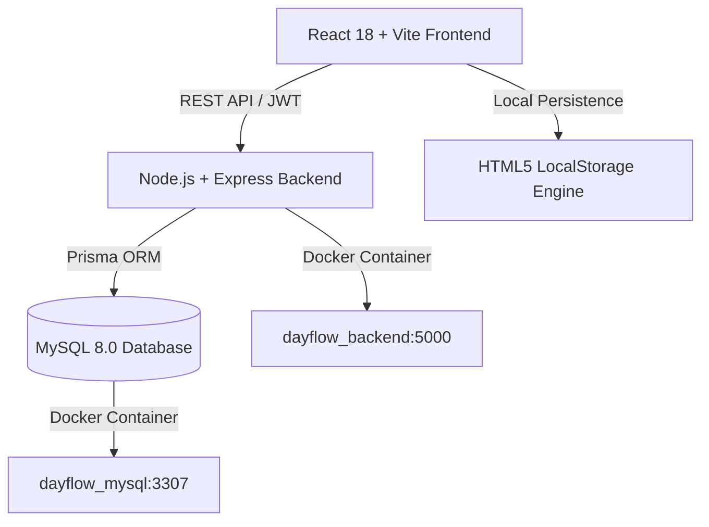

# 🚀 Dayflow HRMS — Enterprise Workforce & Indian Payroll Platform

> **Next-Generation Human Resource Management System (HRMS) built for Indian enterprise scale.**  
> Features dynamic role-based portals (Admin & Employee), automated EPFO/ESI/PT statutory Indian payroll in INR (₹), network-aware biometric attendance muster roll, 6-tab employee KYC & document vault, and intelligent Login ID generation.

---

## 🌟 Executive Summary & Key Highlights

Dayflow HRMS solves the modern enterprise workforce management challenge with a clean, high-performance platform inspired by modern SaaS analytics design systems.

- **Dual Tailored Portals**: Dedicated, permission-restricted experiences for **Executive Admins / HR Officers** and **Employees**.
- **🇮🇳 Indian Statutory Payroll Engine (₹ INR)**: Automated calculations for **Basic Salary**, **HRA (40%)**, **Conveyance**, **EPFO Employee & Employer PF (12%)**, **Professional Tax (₹200/mo)**, **ESI (0.75%)**, and **TDS Income Tax**.
- **📄 Certified Digital Payslips**: Printable PDF-ready salary statements featuring company letterhead (BKC Mumbai), digital signatures, IFSC/UAN/PAN details, and ledger authentication QR codes.
- **🆔 Dynamic Employee Login ID Formula**: Auto-generated in standard enterprise format: `[Company Code] + [First 2 Letters of First & Last Name] + [Year of Joining] + [Serial 4-Digits]` *(e.g. `DFMAVA20210001`, `DFJODO20230001`)*.
- **⏱️ Attendance & Muster Roll**: Live punch clock with WFH/Office Wi-Fi detection, streak tracking, shift counters, and attendance overrides.
- **🔒 Strict Salary Privacy**: Role-based access control ensuring employees only ever view their own personal salary and compensation statements.
- **📁 6-Tab Employee Vault**: Personal KYC (PAN, Aadhaar), Contact & Addresses, Job & Org, Rupee Salary Breakdown, Document Repository, and Lifecycle Management (Probation, Contract Extension, Formal Termination).
- **💾 Full Persistence**: Real-time state persistence across `localStorage` and containerized **MySQL 8.0 / Prisma ORM** backend API.

---

## 🏗️ Architecture & Tech Stack



### Frontend
- **Framework**: React 18 with TypeScript
- **Bundler & Dev Server**: Vite 6
- **Styling**: Tailwind CSS (Custom Color System & SaaS Design Language)
- **Icons**: Lucide React
- **Typography**: Clean Inter / Plus Jakarta Sans

### Backend & Database
- **Runtime**: Node.js with Express & TypeScript
- **ORM**: Prisma ORM
- **Database**: MySQL 8.0 (Containerized via Docker)
- **Authentication**: JWT & Role-Based Access Control (RBAC)
- **Validation**: Strict schema checks, 10-digit Indian phone validation, PAN format validation

---

## ⚡ Quickstart Guide for Judges

You can run the entire platform in **less than 2 minutes** using either Docker or standalone mode.

### Option A: Complete Full-Stack Run with Docker (Recommended)

#### Step 1: Start Database & Backend API (Docker)
In the project root directory, run:
```bash
docker-compose up -d
```
> This spins up:
> - **MySQL 8.0 Database** on port `3307`
> - **Dayflow REST API** on `http://localhost:5000`

#### Step 2: Start the Frontend Web App
In the same root directory, run:
```bash
npm install
npm run dev
```

#### Step 3: Open in Browser
Visit **[http://localhost:3000](http://localhost:3000)** (or `http://localhost:5173`).

---

### Option B: Standalone Frontend Run

If Docker is not installed on your test machine, the frontend runs seamlessly with rich built-in persistence:
```bash
npm install
npm run dev
```
Open **[http://localhost:3000](http://localhost:3000)** in your browser.

---

## 🔑 Test Credentials & Demo Accounts

Use these pre-configured accounts to evaluate different roles and permission levels:

| Role | Name & Designation | Login ID / Email | Password | Key Capabilities |
| :--- | :--- | :--- | :--- | :--- |
| **👑 Admin** | Marcus Vance *(VP of HR)* | `DFMAVA20210001` <br> `admin@dayflow.com` | `Password@123` | Full HRMS command, view all salaries, batch payroll disbursement, manage employees, org chart, audit logs |
| **💼 HR Officer** | Sarah Jenkins *(Senior HR)* | `DFSAJE20220001` <br> `hr@dayflow.com` | `Password@123` | Onboard staff, generate custom payslips, approve leaves, manage document vaults |
| **👤 Employee** | John Doe *(Lead Engineer)* | `DFJODO20230001` <br> `employee@dayflow.com` | `Password@123` | Self-service portal, live punch clock, apply leave, view own payslip only, edit profile |

---

## 📊 Core Modules & Feature Walkthrough

### 1. Dynamic Authentication & Onboarding
- Full-page Sign In and Sign Up workflows matching enterprise specifications.
- Instant password validation with show/hide toggles.
- Real-time preview of the auto-generated enterprise Login ID.

### 2. Executive Admin Dashboard
- **Workforce KPIs**: Total Headcount, Active Today, On Leave, and Average CTC.
- **Attendance & Salary Analysis**: Unit-wise presence vs compensation expense breakdown.
- **Daily Muster Roll**: Live presence table with IP address, network mode, and punch timestamps.

### 3. Employee Directory & 6-Tab Profile Vault
- Searchable directory with department filters and Grid/Table toggle views.
- **Add Employee Modal**: Live photo upload, Indian phone validation, and instant Login ID assignment.
- **6-Tab Profile Modal**:
  1. *Personal Details*: PAN card, masked Aadhaar, blood group, DOB.
  2. *Contact & Addresses*: Residential & permanent hometown addresses, emergency contact.
  3. *Job & Organization*: Designation, department, location, joining date, reporting lead.
  4. *Salary Structure (₹)*: Live earnings & statutory deductions breakdown (Admin/Self only).
  5. *Document Vault*: Upload, preview, and delete verified employee documentation (PDF/Images).
  6. *Lifecycle Actions*: Contract extension, probation confirmation, and formal exit/termination processing.

### 4. Indian Statutory Payroll Hub (₹ INR)
- **Payroll Register**: Shows Basic, HRA, EPF (12%), PT (₹200), TDS, and Net Outflow.
- **Batch Disbursement**: Disburses salaries across the organization with 1 click.
- **Manual Payslip Generator**: Admins can generate custom salary slips for any employee with custom bonuses and month parameters.
- **Interactive Payslip Document**: Certified salary statement with sticky top/bottom actions, Print/PDF export, and working navigation.

### 5. Attendance & Leave Management
- **Interactive Punch Clock**: Shift progress circle, break timer, and office/WFH toggle.
- **Leave Application**: Accrued balance cards (Paid Annual, Sick, Casual), collision alerts, and one-click manager approval workflows.

---

## 🛠️ Verification & Test Suite

Run the automated backend test suite to verify all endpoints, database health, and calculations:
```bash
# Inside the backend/ directory
npx ts-node tests/api-test.ts
```
Expected output:
```text
✔ Checking Health Endpoint (200 OK)
✔ Admin & Employee JWT Authentication (200 OK)
✔ Analytics Dashboard & Unit Breakdown (200 OK)
✔ Punch Clock & Shift Calculation (200 OK)
✔ Leave Application & Collision Detection (201 Created)
✔ Indian Payroll & Salary Generation (200 OK)
=========================================================
🎉 ALL BACKEND ENDPOINTS PASSED VERIFICATION PERFECTLY!
=========================================================
```

---

## 📂 Project Structure

```text
dayflow-hrms/
├── backend/
│   ├── prisma/schema.prisma    # Database schema & models
│   ├── src/
│   │   ├── controllers/        # Auth, Employee, Payroll, Attendance controllers
│   │   ├── routes/             # REST API endpoints
│   │   └── index.ts            # Express server entrypoint
│   └── tests/api-test.ts       # Automated verification test suite
├── src/
│   ├── components/
│   │   ├── attendance/         # AttendanceHub & punch register
│   │   ├── auth/               # AuthPage & login validation
│   │   ├── dashboard/          # MetricsRow, Charts, MusterRollTable
│   │   ├── directory/          # EmployeeDirectory & 6-tab EmployeeModal
│   │   ├── employee-dashboard/ # EmployeeHome & personal hub
│   │   ├── layout/             # Sidebar & TopBar
│   │   ├── leaves/             # LeaveManagement & requests
│   │   ├── org-chart/          # OrgChart tree visualization
│   │   └── payroll/            # PayrollHub & PayslipModal
│   ├── context/HRMSContext.tsx # Central persistent state & RBAC
│   ├── data/mockData.ts        # Seed data with Indian KYC & salary structures
│   ├── services/api.ts         # Axios/Fetch API client
│   ├── types/index.ts          # Complete TypeScript definitions
│   └── App.tsx                 # Root router & layout
├── docker-compose.yml          # Docker composition (MySQL + Backend)
├── Dockerfile                  # Production backend container definition
└── package.json                # Dependencies and build scripts
```

---

## 📜 License

Built with ❤️ for the Odoo Hackathon 2026. Distributed under the MIT License.
